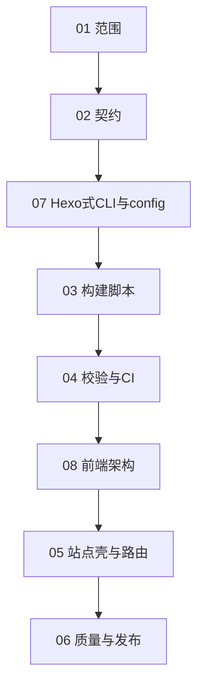

# Schedule 阅读顺序（总索引）

本目录按下表 **推荐阅读顺序** 阅读；**必须先完成后端阶段（01–04），再进入前端阶段（05–06）**（进度见下文「当前进度」）。

## 当前进度（以仓库代码为准 · 2026-03-28）

| 文档 | 状态 | 说明 |
| --- | --- | --- |
| [01](01-backend-goals-and-scope.md) | **基本完成** | 构建管线与失败策略已满足；Typst 版本见 `docs/toolchain.md`。 |
| [02](02-backend-directory-and-metadata.md) | **已完成** | `post/<id>/` + `meta.toml` + `index.typ`；`generate` 注入 `--input`；与实现一致。 |
| [07](07-hexo-like-cli-and-config.md) | **已完成** | `typlog` 二进制、`config.toml`（`SiteConfig`）、`init`/`new`/`generate`/`clean`/`server`/`validate`。 |
| [03](03-backend-build-script.md) | **已完成** | 扫描子目录、`typst compile` HTML、`--clean`/`--verbose`。 |
| [04](04-backend-validation-and-ci.md) | **已完成（初版）** | `validate_generated_site` + `typlog validate`；`.github/workflows/ci.yml`；`docs/toolchain.md`（Typst 0.14.2）。 |
| [05](05-frontend-shell-and-routing.md) | **部分完成** | 已有 `public/index.html` 列表；文章页无统一「返回首页」；`base_url` 未参与链接。 |
| [06](06-frontend-quality-and-release.md) | **未开始** | 样式/RSS/sitemap/部署文档等未做。 |
| [08](08-frontend-architecture.md) | **文档** | 前端主题与「后端嵌入 meta/正文」总架构（读 05 前建议先读） |

**结论**：**后端阶段 01–04 已可收口**；下一优先 **05**（回链 / `base_url`），其次 **06**；整体分工见 **08**。

## 名词约定（本项目内）

- **后端**：不指传统 API 服务，而是 **构建管线**——将 `post/<id>/index.typ` 可靠编译为 `public/posts/<id>/index.html`，并生成首页列表；含失败策略；**校验与 CI 见 04**。**核心构建**（`typlog generate`、CI）**不依赖** Node/npm，见 [07](07-hexo-like-cli-and-config.md)。
- **前端**：**静态站点壳**——版式、导航、CSS、资源路径与可访问性等读者可见层（列表页 HTML 已极简存在，完整壳见 05–06）。**生成器把文章与 meta 嵌入主题槽位** 的分工见 [08](08-frontend-architecture.md)。主题开发、CSS/JS 打包等 **允许** 使用 npm/pnpm 等，但须与核心构建解耦（产物由 `generate` 消费或复制进 `public/`，见 07）。

## 文件顺序（推荐阅读顺序）

**编号 07 建议在读完 02 后阅读**，再进入 03、04，以免构建入口与配置约定反复修改。

| 顺序 | 文件 | 阶段 | 说明 |
| --- | --- | --- | --- |
| 1 | [01-backend-goals-and-scope.md](01-backend-goals-and-scope.md) | 后端 | 范围、里程碑、与前端边界 |
| 2 | [02-backend-directory-and-metadata.md](02-backend-directory-and-metadata.md) | 后端 | 目录、命名、元数据契约 |
| 3 | [07-hexo-like-cli-and-config.md](07-hexo-like-cli-and-config.md) | 横切 | Hexo 式 CLI + 站点配置；**核心构建不依赖 npm**；**CLI 为 Rust `typlog`**；前端工具链另述 |
| 4 | [03-backend-build-script.md](03-backend-build-script.md) | 后端 | 批量编译、清理、失败即停 |
| 5 | [04-backend-validation-and-ci.md](04-backend-validation-and-ci.md) | 后端 | 输出校验、CI（仅构建） |
| 6 | [08-frontend-architecture.md](08-frontend-architecture.md) | 前端 | **主题 + 数据嵌入** 总架构（后端生成如何把 meta/正文填入主题） |
| 7 | [05-frontend-shell-and-routing.md](05-frontend-shell-and-routing.md) | 前端 | 首页、列表、链接与静态资源 |
| 8 | [06-frontend-quality-and-release.md](06-frontend-quality-and-release.md) | 前端 | 样式、无障碍、部署与扩展 |

## 阶段依赖（简图）

## 后端阶段「完成」判定（再开前端 · 与文档 04 对齐）

以下 **与当前代码** 对照：

- [x] 本地一条命令：`typlog generate` 将非草稿 `post/<id>/index.typ` 编译为 `public/posts/<id>/index.html`，失败即退出。
- [x] **校验**：`generate` 末尾及 `typlog validate` 检查非草稿集合与 `public/posts` 一致，并粗检 HTML。
- [x] **CI**：GitHub Actions 安装固定 Typst、`cargo clippy`、`cargo test`、`generate`、`validate`（见 `.github/workflows/ci.yml`）。
- [x] **核心构建链路**（`typlog generate`、CI）**不经过 Node/npm**（前端主题与资源工具链不受此限，见 [07](07-hexo-like-cli-and-config.md)）。
- [x] 空 `post/`（或无有效文章目录）：`generate` **失败**并提示。
