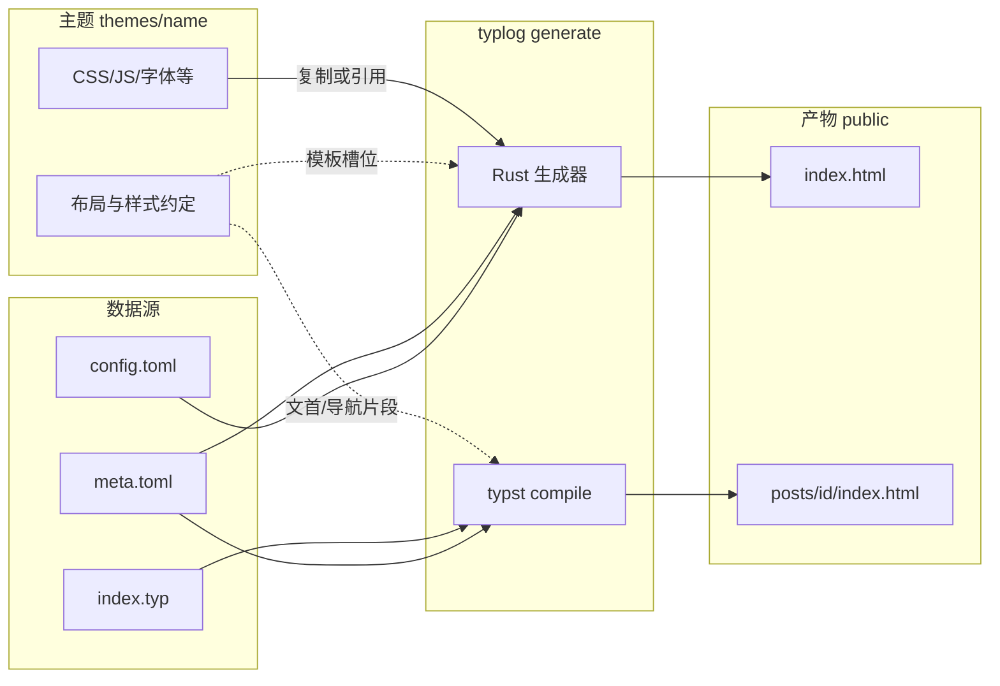

# 08 前端架构：主题与数据嵌入

**文档性质**：**架构说明**（与实现进度无关）；细化「后端生成如何把 **文章正文** 与 **meta** 放进 **主题**」这一分工。实现细节与验收仍以 [05](05-frontend-shell-and-routing.md)、[06](06-frontend-quality-and-release.md) 为准。

## 核心观念

- **主题（Theme）**：只负责 **呈现层**——布局骨架、导航、样式、静态资源路径约定；可含 npm 打包产物，见 [07](07-hexo-like-cli-and-config.md)。
- **后端生成（`typlog generate`）**：负责 **把数据嵌进主题**——读取 `config.toml`、`post/<id>/meta.toml`，排序与过滤（如草稿），再写入 `public/`。
- **嵌入（Embed）**：不是运行时「前端调 API」，而是 **构建期装配**：生成器把 **站点级配置**、**每篇文章的 meta**、以及 **Typst 编译出的正文 HTML** 填进主题预留的槽位，得到最终静态页。

## 数据从哪里来、落到哪

| 数据 | 来源 | 嵌入到哪里 |
| --- | --- | --- |
| 站点标题、`base_url`、`language` 等 | `config.toml`（`SiteConfig`） | 首页 `<head>`、全站导航链接、资源 URL 前缀 |
| 每篇文章的标题、日期、更新等 | `post/<id>/meta.toml`（`PostMeta`） | 首页列表行；文章页顶栏 / meta 区（与正文一起展示） |
| 正文与版式内的数学等 | `post/<id>/index.typ` → `typst compile` | `public/posts/<id>/index.html` 的主体；由 **Typst 模板** 与 `--input` 注入的字段共同决定「文首是否出现标题行」等 |

主题换皮时，**不改** `meta.toml` 契约（见 [02](02-backend-directory-and-metadata.md)）；只换 `themes/<name>/` 下模板与资源，生成器仍按同一套 **结构化数据** 填槽。

## 分工边界（简图）

说明：**虚线**表示主题提供「长什么样、槽位在哪」；**实线**表示生成器与 Typst 把 **配置与 meta** 写进这些槽位。

## 两类嵌入路径

### 1. 首页（列表）

- **输入**：`SiteConfig` + 非草稿 `PostMeta` 列表（已排序）。
- **行为**：生成器按当前主题的 **列表模板**（HTML 片段或模板引擎）渲染 `public/index.html`。
- **嵌入内容**：每条的 `id`、`title`、`date`（及后续扩展字段）；链到 `posts/<id>/index.html`（经 `base_url` 规范化）。

### 2. 文章页

- **正文**：Typst 输出 HTML 片段/页；**meta 展示**（标题、日期、返回首页）优先在 **`templates/post.typ` 或主题提供的 `.typ` 片段** 中完成，以便与 HTML 导出一致；生成器通过 **`--input`** 把 `title`、`date`（及将来的 `home_href`、`updated` 等）注入，相当于 **把 meta 嵌进同一套主题叙事**。
- **可选**：若将来采用「编译后再注入 `<header>`」方案，仍属于生成器侧对主题契约的实现，不改变「meta 来自 `meta.toml`、由生成管线注入」的原则。

## 可扩展主题意味着什么

- 新增主题 = 新增 `themes/<theme_id>/`：**布局约定 + 静态资源**；`config.toml` 中 `theme = "<theme_id>"` 指向它。
- 生成器侧保留 **默认主题** 与稳定的 **数据→槽位** API（例如 `render_index(site, posts)`、每篇文章的 `compile_inputs(meta, site)`），避免把 HTML 字符串散落在各处。
- **不**要求主题用何种工具链产出 CSS/JS；仅要求 **构建产物路径** 与生成器复制/引用规则一致（见 [05](05-frontend-shell-and-routing.md)）。

## 与相邻文档的关系

| 文档 | 内容 |
| --- | --- |
| [05](05-frontend-shell-and-routing.md) | 路由、`base_url`、MVP 验收 |
| [06](06-frontend-quality-and-release.md) | SEO、RSS、部署与体验 |
| [07](07-hexo-like-cli-and-config.md) | CLI、配置、核心构建与前端工具链边界 |

## 时间估算

- 架构落地（主题目录 + 首页模板化 + meta 注入统一）：与 [05](05-frontend-shell-and-routing.md) 中「MVP 壳」估算一致，不单独加档。
