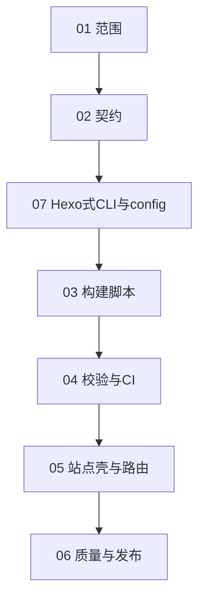

# Schedule 阅读顺序（总索引）

本目录按 **编号顺序** 阅读与执行；**必须先完成后端阶段（01–04），再进入前端阶段（05–06）**。

## 名词约定（本项目内）

- **后端**：不指传统 API 服务，而是 **构建管线**——将 `post/*.typ` 可靠编译为 `public/posts/*.html`，含失败策略、校验、CI 构建与版本锁定。
- **前端**：**静态站点壳**——首页、列表、归档、导航、CSS、资源路径与可访问性等读者可见层。

## 文件顺序（推荐阅读顺序）

**编号 07 建议在读完 02 后阅读**，再进入 03、04，以免构建入口与配置约定反复修改。

| 顺序 | 文件 | 阶段 | 说明 |
| --- | --- | --- | --- |
| 1 | [01-backend-goals-and-scope.md](01-backend-goals-and-scope.md) | 后端 | 范围、里程碑、与前端边界 |
| 2 | [02-backend-directory-and-metadata.md](02-backend-directory-and-metadata.md) | 后端 | 目录、命名、元数据契约 |
| 3 | [07-hexo-like-cli-and-config.md](07-hexo-like-cli-and-config.md) | 横切 | Hexo 式 CLI + 站点配置；**构建不依赖 npm**；**CLI 首选 Rust** |
| 4 | [03-backend-build-script.md](03-backend-build-script.md) | 后端 | 批量编译、清理、失败即停 |
| 5 | [04-backend-validation-and-ci.md](04-backend-validation-and-ci.md) | 后端 | 输出校验、CI（仅构建） |
| 6 | [05-frontend-shell-and-routing.md](05-frontend-shell-and-routing.md) | 前端 | 首页、列表、链接与静态资源 |
| 7 | [06-frontend-quality-and-release.md](06-frontend-quality-and-release.md) | 前端 | 样式、无障碍、部署与扩展 |

## 阶段依赖（简图）

## 后端阶段「完成」判定（再开前端）

- 本地一条命令（与 [07-hexo-like-cli-and-config.md](07-hexo-like-cli-and-config.md) 中的 **`generate` 等价命令**）：`post/*.typ` 全量编译为 `public/posts/*.html`，失败即退出且日志可定位文件。
- 校验通过：输入篇数与输出 HTML 一致（排除草稿规则）、无重复文章 id。
- CI 已跑通上述构建与校验；**不要求**首页美观或完整导航。
- **构建链路不经过 Node/npm**（见 07）。
