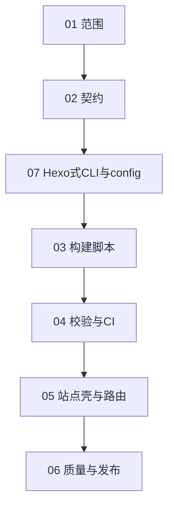

# Schedule 阅读顺序（总索引）

本目录按下表 **推荐阅读顺序** 阅读；**必须先完成后端阶段（01–04），再进入前端阶段（05–06）**（进度见下文「当前进度」）。

## 当前进度（以仓库代码为准 · 2026-03-28）

| 文档 | 状态 | 说明 |
| --- | --- | --- |
| [01](01-backend-goals-and-scope.md) | **基本完成** | Rust + `typlog generate` 管线已落地；Typst 精确版本未在仓库锁定；失败即停已满足。 |
| [02](02-backend-directory-and-metadata.md) | **已完成** | `post/<id>/` + `meta.toml` + `index.typ`；`generate` 注入 `--input`；与实现一致。 |
| [07](07-hexo-like-cli-and-config.md) | **已完成** | `typlog` 二进制、`config.toml`（`SiteConfig`：`title` / `base_url` / `language`）、`init`/`new`/`generate`/`clean`/`server`。 |
| [03](03-backend-build-script.md) | **已完成** | 扫描子目录、`typst compile --features html --format html`、`--clean`/`--verbose`；**未**单独记录 Typst 版本文件。 |
| [04](04-backend-validation-and-ci.md) | **未开始** | 无 GitHub Actions / 无「篇数 vs 产物」自动校验脚本；README 未写完整复现步骤。 |
| [05](05-frontend-shell-and-routing.md) | **部分完成** | 已有 `public/index.html` 列表与链接；文章页由 Typst 导出 HTML，**尚无**统一「返回首页」链；`config.base_url` 尚未参与链接拼接。 |
| [06](06-frontend-quality-and-release.md) | **未开始** | 样式/RSS/sitemap/部署文档等未做。 |

**结论**：当前处于 **后端主干（01–03 + 07）已可用**，**04（校验 + CI）与 05 剩余项、06 未做**。下一优先工作建议：**04**（CI + 校验），其次 **05**（文章页回链 / base URL）。

## 名词约定（本项目内）

- **后端**：不指传统 API 服务，而是 **构建管线**——将 `post/<id>/index.typ` 可靠编译为 `public/posts/<id>/index.html`，并生成首页列表；含失败策略；**校验与 CI 见 04**。
- **前端**：**静态站点壳**——版式、导航、CSS、资源路径与可访问性等读者可见层（列表页 HTML 已极简存在，完整壳见 05–06）。

## 文件顺序（推荐阅读顺序）

**编号 07 建议在读完 02 后阅读**，再进入 03、04，以免构建入口与配置约定反复修改。

| 顺序 | 文件 | 阶段 | 说明 |
| --- | --- | --- | --- |
| 1 | [01-backend-goals-and-scope.md](01-backend-goals-and-scope.md) | 后端 | 范围、里程碑、与前端边界 |
| 2 | [02-backend-directory-and-metadata.md](02-backend-directory-and-metadata.md) | 后端 | 目录、命名、元数据契约 |
| 3 | [07-hexo-like-cli-and-config.md](07-hexo-like-cli-and-config.md) | 横切 | Hexo 式 CLI + 站点配置；**构建不依赖 npm**；**CLI 为 Rust `typlog`** |
| 4 | [03-backend-build-script.md](03-backend-build-script.md) | 后端 | 批量编译、清理、失败即停 |
| 5 | [04-backend-validation-and-ci.md](04-backend-validation-and-ci.md) | 后端 | 输出校验、CI（仅构建） |
| 6 | [05-frontend-shell-and-routing.md](05-frontend-shell-and-routing.md) | 前端 | 首页、列表、链接与静态资源 |
| 7 | [06-frontend-quality-and-release.md](06-frontend-quality-and-release.md) | 前端 | 样式、无障碍、部署与扩展 |

## 阶段依赖（简图）

## 后端阶段「完成」判定（再开前端 · 与文档 04 对齐）

以下 **与当前代码** 对照：

- [x] 本地一条命令：`typlog generate` 将非草稿 `post/<id>/index.typ` 编译为 `public/posts/<id>/index.html`，失败即退出。
- [ ] **校验**：`post/` 参与构建篇数与 `public/posts/` 下输出一致（排除草稿）——**尚未实现**。
- [ ] **CI**：固定 Typst 版本、非 npm 构建——**尚未实现**。
- [x] **构建链路不经过 Node/npm**。
- [x] 空 `post/`（或无有效文章目录）：`generate` **失败**并提示。
